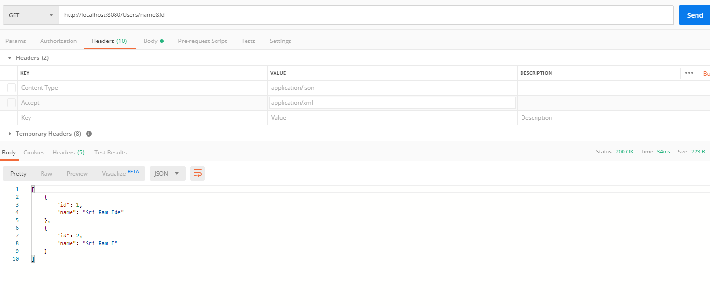

# Static and Dynamic Data Filtering/Hiding in SpringBoot

### Use Case

### Assume User Model obj wants to hide phone number for all get requests

### use @JsonIgnore annontation to hide this to the end requester.

### Dynamic Use Case

#### Wants to define a customized response base on request

#### User MappingJacksonValue and follow the steps as guided also find this on the image attached

* MappingJacksonValue mapping = new MappingJacksonValue(user2);

* mapping.setFilters(filters);

* FilterProvider filters = new SimpleFilterProvider().addFilter("customfilter", filter); 

* SimpleBeanPropertyFilter filter = SimpleBeanPropertyFilter.filterOutAllExcept("name", "phoneNumber");

* Make sure you annotate @JsonFilter(value = "customfilter") on user model

#### Important Dependency

* jackson-dataformat-xml

## Images

